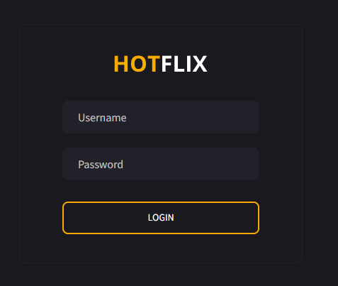
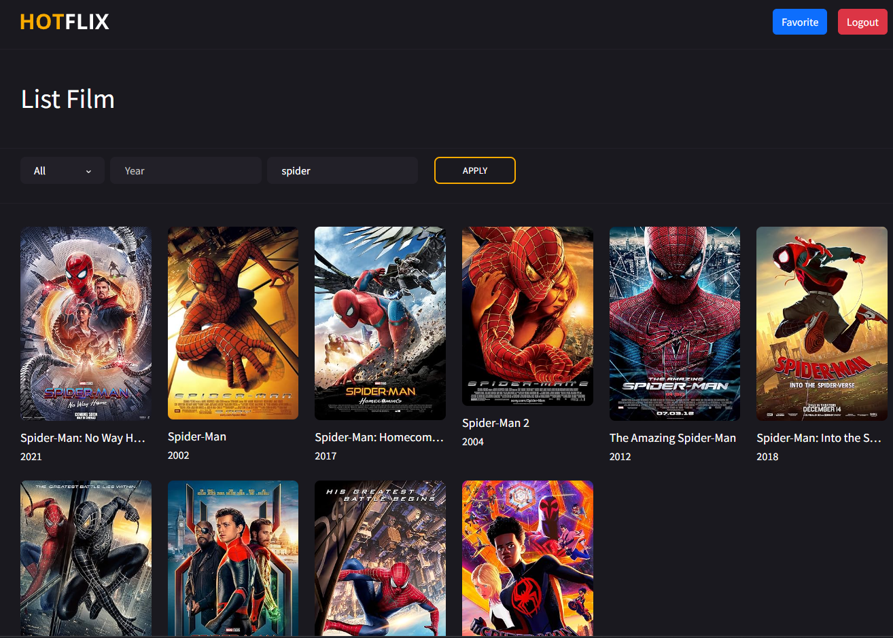
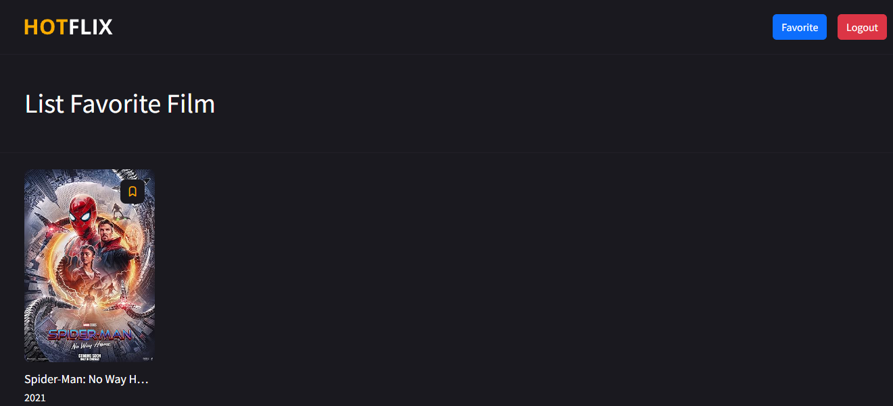
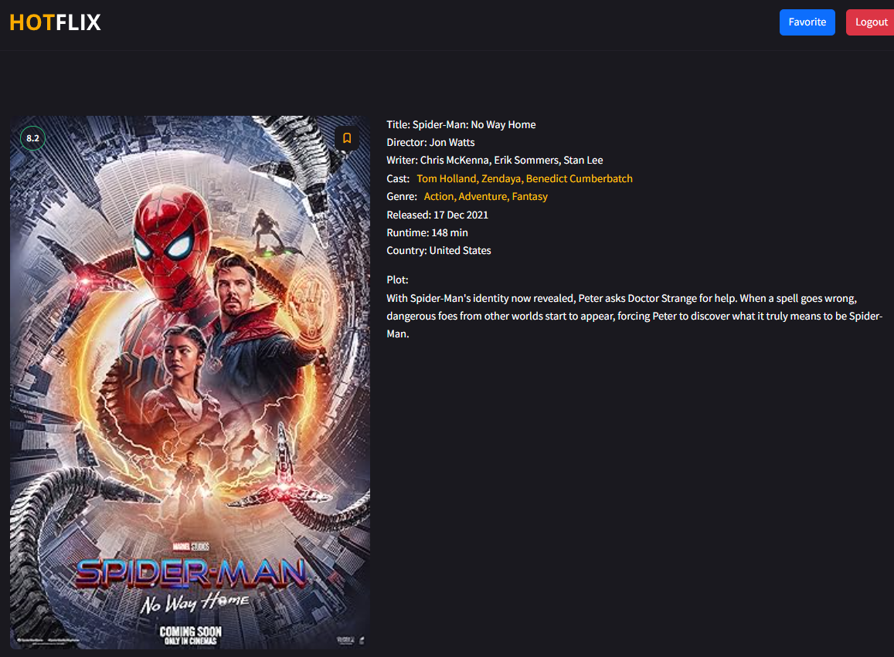

# Hotflix Documentation

## Overview
This document outlines the setup and structure of Hotflix. This apps are using :
- Laravel 5.8 as main framework
- MySQL for database
- Guzzle for Http client
- Architecture based on MVC, but i custom to Model -> View -> Controller -> Validation -> Service

## System Requirements
- PHP 7.2
- MySQL 5.7 or higher
- Composer for dependency management

## Installation Steps

1. **Install Dependencies**
   ```bash
   composer install
   ```

2. **Setup Environment**
   
   Copy the `.env.example` file to `.env` and update the database and other configurations as necessary.
   ```bash
   cp .env.example .env
   ```

3. **Apply Config**
   ```bash
   php artisan config:cache
   ```

4. **Run Migrations and Seed the Database**
   ```bash
   php artisan migrate:fresh --seed
   ```

5. **Run Application**
   ```bash
   php artisan serve
   ```

## Screenshot
### Login Page



### Home Page



### Favorite Page



### Detail Page



## Contributing
Contributions to the Hotflix project are welcome. Please ensure that your code adheres to the Laravel best practices and include tests for new features.

## License
This Hotflix is open-sourced software licensed under the [MIT license](https://opensource.org/licenses/MIT).
